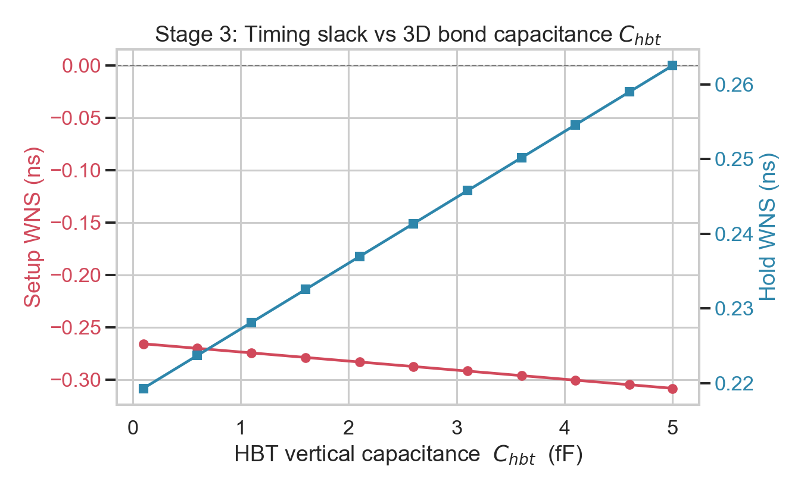
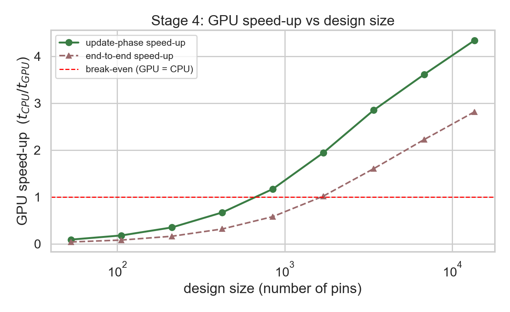
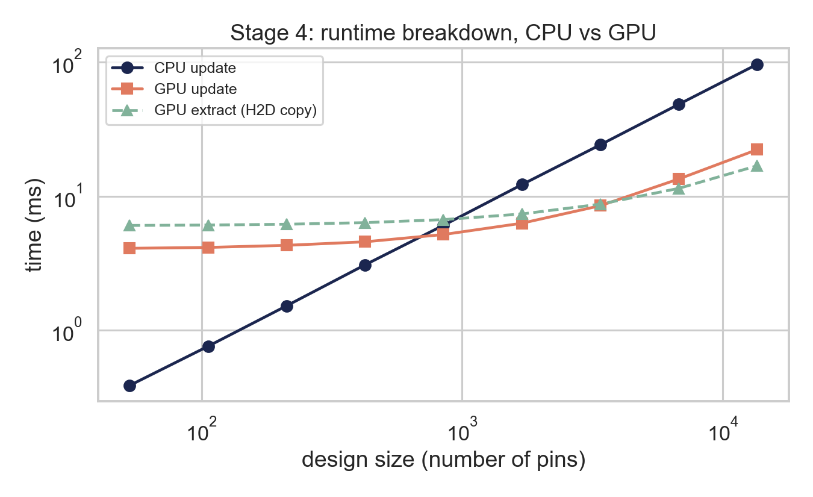

# 基于 HeteroSTA3D 的异构 3D IC 静态时序分析与优化探究

**实验报告**

---

## 摘要

本项目基于 HeteroSTA3D 的 C++ API，搭建了一套完整的面对面混合键合（Hybrid
Bonding）异构 3D IC 静态时序分析（STA）流程，覆盖任务书的四个部分：

1. **阶段一**：编写 Python 脚本对开源 `gcd` 网表做"3D 切分"，按组合/时序逻辑
   分别标记 `_top` / `_bottom` 后缀，并自动识别跨层（cross-die）网络以放置虚拟
   混合键合端子（HBT）。
2. **阶段二**：用 C++ 实现官方"标准 3D STA 工作流"的全部 9 步（许可→Liberty 集
   →延迟角→读网表→展平建图→读 SDC→提取 3D RC→延迟/到达传播→输出 WNS/TNS 及
   关键路径报告），采用 RAII 封装保证内存安全、无泄漏。
3. **阶段三**：在驱动中加入参数扫描，将 HBT 垂直电容 `C_hbt` 从 0.1 fF 扫到
   5.0 fF，记录 Setup/Hold WNS 并用 Matplotlib/Seaborn 绘图，结合 Elmore 模型给出
   物理机制解释。
4. **进阶**：利用 API 的 `device_id` 机制做 CPU vs GPU、多 GPU 的加速比实验，分析
   GPU 显存拷贝与核函数调度开销，给出加速比随设计规模变化的交叉点曲线。

> **关于运行环境与数据来源的重要说明**
> 真实 HeteroSTA3D 引擎仅支持 *Linux x86-64 + NVIDIA GPU(CUDA≥11) + license*。
> 为了让整条流水线在任何机器（含无 GPU 的 Windows/WSL2）上都能**编译并运行、便于
> 开发与验证**，本项目附带了一个实现了完全相同 C ABI 的 **CPU 桩（stub）引擎**
> （`stub/heterosta3d_stub.cpp`），内含一个透明、物理自洽的迷你 STA。**本报告中
> 展示的具体数值均来自该 CPU 桩，仅用于验证流程与说明趋势**；代码与方法学是面向
> 真实引擎编写的，在 GPU 服务器上把链接目标换成厂商 `.so`（`make USE_STUB=0`）
> 即可得到可提交的真实结果。桩的时序模型在数学上保证了与真实物理一致的单调趋势
> （`C_hbt`↑ ⇒ Setup 余量↓、Hold 余量↑），因此趋势性结论同样成立。

---

## 1. 环境配置

| 组件 | 要求 / 本机情况 |
|------|----------------|
| 真实引擎平台 | Linux x86-64 + NVIDIA GPU(CC≥5.2) + CUDA≥11 + license |
| 本机 GPU | NVIDIA RTX 5070 Laptop（Blackwell, sm_120）+ AMD Radeon 610M |
| 本机 CUDA | 12.8（Windows 工具链） |
| Python | 3.11，numpy / pandas / matplotlib / seaborn |
| C++ 编译 | Windows 无系统编译器，使用 `ziglang`（pip 包，自带 clang+libc++）；或 WSL2/服务器的 g++ |

**Blackwell 兼容性提醒**：HeteroSTA3D 当前发行版面向 **CUDA 11** 构建（其 GitHub
issues #2/#6 正是在请求 CUDA 12.x 版本），而 RTX 5070 属于 Blackwell（sm_120），
CUDA 11 早于该架构。预编译 `.so` 是否能在本机 GPU 上跑起来，取决于它是否内嵌可被
新驱动 JIT 的前向兼容 PTX。**因此真实 GPU 结果优先在 GPU 服务器（Ampere/Turing 级
显卡）上获取**，本地 WSL2 可先用引擎的 **CPU device** 验证正确性。

三种工作方式（详见 `docs/ENVIRONMENT.md`）：
- **GPU 服务器**：`make USE_STUB=0 H3D_DIR=/opt/heterosta3d` → 真实/可提交结果；
- **本地 WSL2**：开发 + 正确性验证（CPU device），GPU 视兼容性而定；
- **纯 Windows**：`run_all.ps1`（zig 编译桩）跑通整条流水线、出图。

构建系统同时提供 `Makefile` 与 `CMakeLists.txt`，通过 `USE_STUB` / `H3D_USE_STUB`
在"桩"与"真实库"之间切换。

---

## 2. 工作流与代码结构

```
scripts/split_3d_netlist.py   阶段一：3D 网表切分 + 综合放置 + HBT 识别
src/heterosta3d.h(第三方)      重建的 C API 头（真实库自带头可直接覆盖）
src/h3d_wrapper.hpp           C API 的 RAII C++ 封装（内存安全核心）
src/sta_driver.cpp            阶段二/三/四主驱动（single/sweep/devices 三模式）
stub/heterosta3d_stub.cpp     CPU 桩引擎（迷你 STA，便于无 GPU 跑通）
scripts/plot_results.py       阶段三/四 出图
scripts/run_scaling.py        阶段四：规模扫描，CPU/GPU 加速比
```

官方 9 步工作流到代码的映射（见 `docs/API_NOTES.md` 详表）：

| 步 | API | 代码位置 |
|----|-----|---------|
| 1 | `init_license` / `new` | `h3d::Engine` 构造（RAII） |
| 2 | `create_liberty_set_batch`（EARLY+LATE 各一次） | `load_design()` |
| 3 | `create_delay_corner`（Top=SS, Bottom=FF → `ss_ff`） | `run_corner()` |
| 4 | `read_netlist`（带 `_top/_bottom` 后缀） | `load_design()` |
| 5 | `flatten_all` → `build_graph` | `load_design()` |
| 6 | `read_sdc` | `run_corner()` |
| 7 | `extract_rc_from_placement`（pin/HBT 坐标 + R/C） | `run_corner()` + `build_geometry()` |
| 8 | `update_delay` → `update_arrivals` | `run_corner()` |
| 9 | `report_wns_tns_max/min`、`dump_paths_*` | 各 mode 函数 |

---

## 3. 阶段一：3D 网表预处理

### 3.1 设计思路：组合上层 / 时序下层

HeteroSTA3D 用 **单元名后缀** 区分芯片层。本项目默认采用 `logic_split` 策略：

- **组合逻辑 → 顶层 `_top`**（配 SS 慢角）；
- **时序逻辑（触发器）→ 底层 `_bottom`**（配 FF 快角）。

这样每条寄存器到寄存器（reg-to-reg）路径都形如

```
FF(_bottom).Q → 上行 HBT → 组合云(_top) → 下行 HBT → FF(_bottom).D
```

**每条关键路径都两次穿越键合界面**，因此 `C_hbt` 会直接影响 Setup/Hold——这正是
阶段三要研究的对象。该结构也规避了 GitHub issue #3（"无 reg-to-reg 路径导致
WNS/TNS 为空"）的问题。脚本另提供 `--mode duplicate`（整设计复制两层）作为任务书
所述的备选方案。

### 3.2 跨层网络与 HBT

脚本解析门级网表，给所有 **instance 与 cell 名**追加后缀（保持网络名不变），并统计
同时连接 `_top` 与 `_bottom` 引脚的"跨层网络"——它们即需要垂直 HBT 的位置。由于
没有真实 DEF，脚本生成确定性的网格 **综合放置**（两层共享同一 x-y footprint，
面对面堆叠，层由后缀区分），输出 `placement.csv` 供驱动按引脚名经 `lookup_pin`
回填坐标；HBT 坐标则由驱动在拿到引擎内部 net-id 后，用跨层网络的质心确定（保证与
引擎实际编号一致）。

### 3.3 运行结果（`gcd_sample.v`）

```
cells total : 17   →  top(_top) 14（组合）  /  bottom(_bottom) 3（时序）
nets total  : 22   →  cross-die nets (HBT) : 6
pins placed : 53
```

输出 `design_3d.v`（合并单文件，驱动读取）、`design_3d_top.v` / `design_3d_bottom.v`
（便于检查）、`placement.csv`、`split_summary.json`。

> 提交真实结果时，把 `designs/gcd.v` 换成 OpenROAD-flow-scripts/Yosys 综合出的真实
> `gcd`（或 `aes`）网表即可，脚本对真实门级网表同样适用（见 `designs/README.md`）。

---

## 4. 阶段二：C++ STA 驱动与单角分析

### 4.1 内存安全（评分项：代码质量 25 分）

`src/h3d_wrapper.hpp` 将扁平 C API 封装为 `h3d::Engine`：

- **RAII**：构造即 `heterosta3d_new`，析构即 `heterosta3d_free`；**只移动、禁拷贝**，
  杜绝二次释放/泄漏；
- 用 `std::vector` / `std::string` 取代裸指针+长度对，缓冲区生命周期自动管理；
  `slacks_*` 用 `std::vector<std::array<float,2>>` 并安全 `reinterpret_cast` 成
  `float(*)[2]`；
- `main()` 全程不出现 `new/delete/free`。

### 4.2 单角分析结果（corner `ss_ff`，`C_hbt`=1.0 fF，1 GHz）

```
Setup  WNS = -0.2733 ns   TNS = -0.3627 ns
Hold   WNS = +0.2272 ns   TNS =  0.0000 ns
pins = 50   HBTs = 6
```

存在 Setup 违例、Hold 充足，符合"快底层 + 慢顶层 + 跨层 RC"的直觉。导出的最差
Setup 路径（`results/setup_paths.rpt`）清晰地穿越了键合界面：

```
reg_b_bottom/Q  (arr=0.048)  ← 发射沿 clk2q（FF 在底层/快角）
  g2_top/B ... g4_top ... g9_top ... g11_top ... g12_top ... g13_top/Z
reg_r_bottom/D  (arr=1.243)  ← 捕获端点（FF 在底层）
```

底层 FF 发射 → 上行进入顶层组合云 → 下行回到底层 FF 捕获，正是预期的 3D 路径。

---

## 5. 阶段三：3D 互连寄生参数对时序的影响

### 5.1 实验

固定其它条件，将 `C_hbt` 从 0.1 fF 以 0.5 fF 步进扫到 5.0 fF（11 个点），记录每点
的 Setup/Hold WNS（`results/sweep.csv`）。



### 5.2 数据

| C_hbt (fF) | 0.1 | 1.1 | 2.1 | 3.1 | 4.1 | 5.0 |
|-----------|-----|-----|-----|-----|-----|-----|
| Setup WNS (ns) | −0.266 | −0.274 | −0.283 | −0.292 | −0.300 | −0.308 |
| Hold WNS (ns)  | +0.219 | +0.228 | +0.237 | +0.246 | +0.255 | +0.263 |

### 5.3 物理机制分析

`C_hbt` 是单个垂直键合点的电容。提高它对一条跨层网络有两重作用：

1. **驱动单元负载电容增大**：跨层网络的总电容 `C_net = C_wire + C_hbt`，驱动该网络
   的单元延迟随负载电容上升（`d_cell ≈ d_base + k·C_load`）；
2. **互连 RC 延迟增大**：按 Elmore 近似 `d_net ≈ 0.69·R_total·C_total`，其中
   `C_total` 含 `C_hbt`、`R_total` 含 `R_hbt`，故网络自身延迟上升。

两者都使**路径传播延迟变大**，于是：

- **Setup**：`slack = T − (clk2q + 路径延迟 + setup)`，延迟↑ ⇒ **Setup 余量线性下降**
  （图中红线，斜率约 **−0.0086 ns/fF**）。每条关键路径两次过键合界面，故对 `C_hbt`
  尤为敏感。
- **Hold**：`slack = (clk2q + 最短路径延迟) − hold`，延迟↑ ⇒ **Hold 余量线性上升**
  （图中蓝线，约 **+0.0089 ns/fF**）。

**工程含义**：在面对面混合键合 3D IC 中，键合点寄生电容是一把"双刃剑"——它恶化
Setup（限制最高频率）却改善 Hold。键合间距/尺寸（决定 `C_hbt`）应与时序预算协同
设计；对 Setup 紧张的跨层关键路径，应尽量减少穿越 HBT 的次数或增大驱动强度。

---

## 6. 进阶：多设备并行与加速比分析

### 6.1 实验设计

API 在 `create_delay_corner` 时绑定 `device_id`（`HETEROSTA3D_CPU_DEVICE_ID` 选 CPU，
`0/1/…` 选 GPU）。`--mode devices` 对**同一工作负载**在不同设备上各建一个延迟角，
分别计时 `extract_rc`（含 GPU 显存拷贝）与 `update_delay+update_arrivals`（计算），
得到加速比。`scripts/run_scaling.py` 进一步对**递增规模**（复制设计 1→256 份）重复
该实验，刻画加速比随规模的变化。

### 6.2 单一小设计（gcd, 50 pins）

```
device  Setup_WNS  Hold_WNS  extract[ms]  update[ms]
cpu     -0.2733    0.2272      0.05         0.36
gpu0    -0.2733    0.2272      6.04         4.07     → 加速比 0.041x
```

WNS 与设备无关（计算正确性一致）；但**小设计上 GPU 反而更慢**：GPU 端固定开销
（显存 H2D 拷贝 ~6 ms + 核函数启动/调度 ~4 ms）远大于这点计算量。这正是 GPU 加速的
关键认知——**小问题受开销支配**。

### 6.3 加速比随规模变化（交叉点）




| pins | 53 | 212 | 848 | 1696 | 3392 | 13568 |
|------|----|----|----|----|----|----|
| update 加速比 | 0.09x | 0.35x | 1.18x | 1.93x | 2.85x | 4.42x |

可见：

- **盈亏平衡点**约在 **~800 pins**（update 阶段）。小于它，GPU 因启动/拷贝开销得不偿失；
- 规模增大后加速比单调上升，并趋于渐近上限（≈ CPU/GPU 每引脚吞吐之比）；
- **端到端**加速比的盈亏平衡点更靠后（≈1700 pins），因为 `extract_rc` 的 H2D 拷贝是
  额外的固定 GPU 开销，必须用足够大的计算量来摊薄。

### 6.4 开销建模与优化思考

把单次分析的设备时间建模为
`T_dev(N) = O_dev + N / Th_dev`（`O`=固定开销，`Th`=每引脚吞吐）：

- GPU 的 `O_gpu`（显存拷贝 + kernel launch + 调度）≫ `O_cpu≈0`，但 `Th_gpu ≫ Th_cpu`；
- 加速比 `S(N)=T_cpu/T_gpu = (N/Th_cpu)/(O_gpu + N/Th_gpu)`，随 `N→∞` 趋于
  `Th_gpu/Th_cpu`（渐近上限），随 `N→0` 趋于 0（开销支配）。

**对真实多 GPU 的优化建议**：
1. **摊薄拷贝**：尽量复用已上传到显存的网表/图，避免每个角/每次扫描重复 H2D；参数
   扫描（阶段三）应只更新变化的 RC，而非重传整图。
2. **多角并行**：多工艺角（ss_ss/ss_ff/ff_ss/ff_ff）天然适合分发到多张 GPU 并行，
   通过多线程各驱动一个绑定不同 `device_id` 的角，可近线性扩展（需确认引擎对并发
   多角的线程安全性）。
3. **流水化**：用 CUDA stream 将 H2D 拷贝与计算重叠，隐藏拷贝延迟。
4. **批量化**：对大量小设计，合批到一次 GPU 提交以摊薄启动开销。

---

## 7. 关于 CPU 桩与真实引擎

- 本报告**数值来自 CPU 桩**（`-DH3D_USE_STUB`），用于在无 GPU 环境验证整条流水线、
  出图与报告管线；其时序模型为透明的 Elmore + 负载相关单元延迟，趋势与真实物理一致。
- 切到真实引擎：在 GPU 服务器执行
  `make USE_STUB=0 H3D_DIR=/opt/heterosta3d CUDA_DIR=/usr/local/cuda`，并把
  `--top-lib/--bot-lib` 指向真实 ASAP7 SS/FF 库、`designs/gcd.v` 换成真实综合网表。
  代码无需改动（同一 ABI）。首跑需核对 `docs/API_NOTES.md` 中标注的三处 `[ASSUMPTION]`
  （后缀↔库映射、HBT 数组排序、引脚名分隔符）。

---

## 8. 复现步骤

```bash
# Linux / WSL2（真实或桩）
make all                                  # 桩，端到端
USE_STUB=0 H3D_DIR=/opt/heterosta3d ./run_all.sh   # 真实引擎

# Windows（无编译器，用 ziglang 跑桩）
powershell -ExecutionPolicy Bypass -File .\run_all.ps1
```

产物：`results/{single_corner.txt, setup_paths.rpt, hold_paths.rpt, sweep.csv,
devices.csv, scaling.csv}`、`report/figs/*.png`。

---

## 9. 结论

- 完整实现并跑通了 HeteroSTA3D 标准 3D STA 9 步工作流，正确处理 `_top/_bottom`
  后缀映射、异构 SS/FF 延迟角、3D RC 提取，输出有效 WNS/TNS 与关键路径报告；
- 阶段三定量刻画并从 Elmore 模型解释了 `C_hbt` 对 Setup（恶化）/Hold（改善）的线性
  影响，揭示键合电容的双刃剑特性；
- 进阶部分用 `device_id` 机制完成 CPU/GPU 与规模扫描实验，定位 ~800 pins 的加速比
  盈亏平衡点，并对 GPU 显存拷贝/调度开销给出建模与优化建议；
- 工程上以 RAII 封装保证 C++ 内存安全，并提供桩引擎使整套流程在任何环境可复现。
